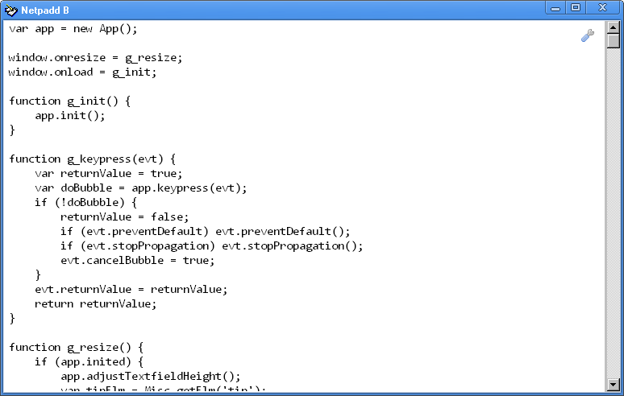
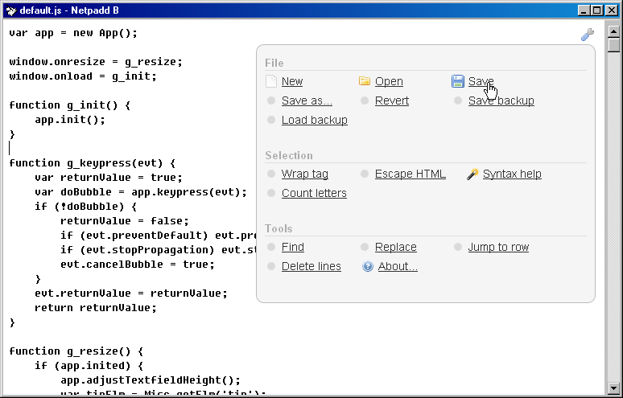

# Netpadd

Netpadd started out as a Windows text editor I used for coding + markup. This followup version, called Netpadd B, was a weekend experiment to use JavaScript in a local browser for editing. <a href="http://blogoscoped.com/archive/2009-10-04-n43.html">More background here</a>. (Please see the original-readme.txt file for further credits.) Hope you enjoy this Vintage release!

&nbsp;

